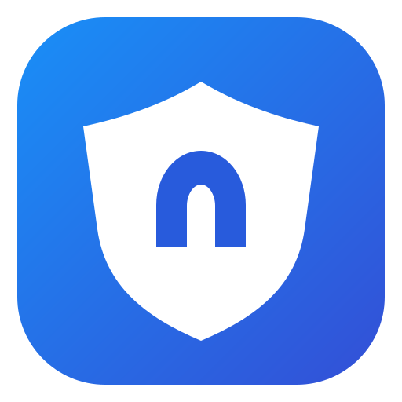

<p align="center">
  
</p>

<h1 align="center">Maos VPN</h1>

<p align="center">A lightweight, open-source VPN subscription client for older Intel Macs.</p>

<p align="center">
  <a href="README.en.md">English</a> · <a href="README.ru.md">Русский</a>
</p>

<p align="center">
  <a href="../../actions/workflows/build.yml"></a>
  
  
  
  
</p>

Maos VPN imports a subscription URL, displays its servers, and routes macOS traffic through a system TUN interface powered by the bundled `sing-box` engine. It is designed for Macs that cannot install clients requiring macOS 12 or newer.

## Download

Download the latest `.dmg` or `.zip` from **[GitHub Releases](../../releases/latest)**.

Requirements:

- macOS Catalina 10.15 or newer;
- Intel (`x86_64`) Mac;
- an active compatible subscription URL.

## Features

- Native, uncluttered AppKit interface;
- Russian and English UI with live language switching;
- Base64 and plain-text subscriptions;
- VLESS, VMess, Trojan, and Shadowsocks profiles;
- TCP, WebSocket, gRPC, HTTPUpgrade, TLS, and Reality options;
- full-device TUN routing for browsers and applications;
- local-only profile storage and no analytics;
- automatic update notifications with verified one-click installation;
- automated, validated GitHub Actions builds with checksums.

## Quick start

1. Download and open the DMG.
2. Drag **Maos VPN.app** into **Applications**.
3. On first launch, right-click the app and choose **Open**.
4. Paste your subscription URL and click **Load**.
5. Select a server and click **Connect**.
6. Approve the macOS administrator prompt used to create the TUN interface.

The administrator password is handled by macOS and is never received or stored by Maos VPN.

## Documentation

- [English user guide](README.en.md)
- [Русское руководство](README.ru.md)
- [Privacy](docs/PRIVACY.md) · [Конфиденциальность](docs/PRIVACY.ru.md)
- [Troubleshooting](SUPPORT.md)
- [Architecture](docs/ARCHITECTURE.md)
- [Security policy](SECURITY.md)
- [Contributing](CONTRIBUTING.md) · [Как помочь проекту](CONTRIBUTING.ru.md)

## Build from source

GitHub Actions builds and validates the Intel app automatically. To create a public release, push a version tag:

```bash
git tag v0.1.0
git push origin v0.1.0
```

The workflow publishes `.dmg`, `.zip`, and `SHA256SUMS.txt` files to GitHub Releases.

## Security notice

A subscription URL is usually a secret credential. Never paste a real subscription into an issue, pull request, screenshot, test, or public repository. Revoke it immediately if it is exposed.

## License

Maos VPN is available under the [MIT License](LICENSE). Release packages bundle the independent GPL-licensed `sing-box` executable; see [third-party notices](THIRD_PARTY_NOTICES.md).

Maos VPN is an independent project and is not affiliated with Apple, Happ, SagerNet, or any VPN provider. Use it only where permitted by applicable law and your provider's terms.
